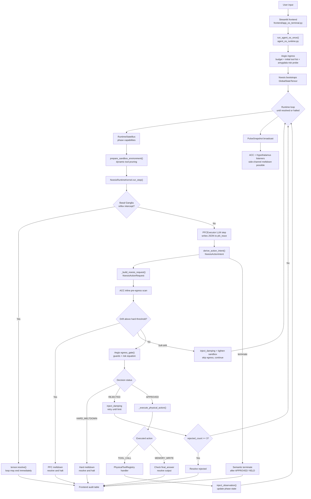
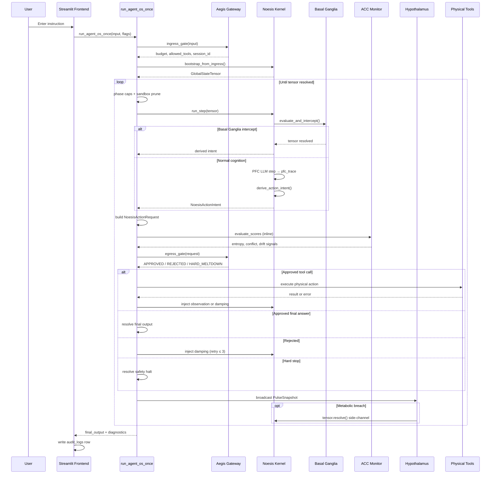
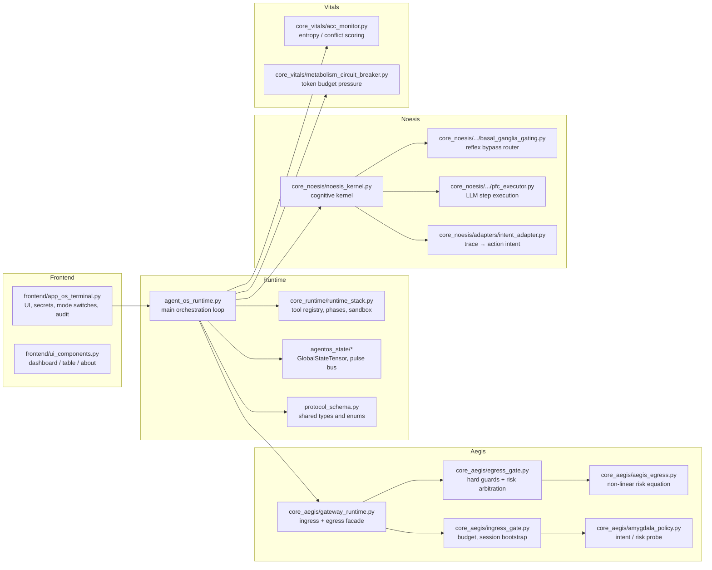
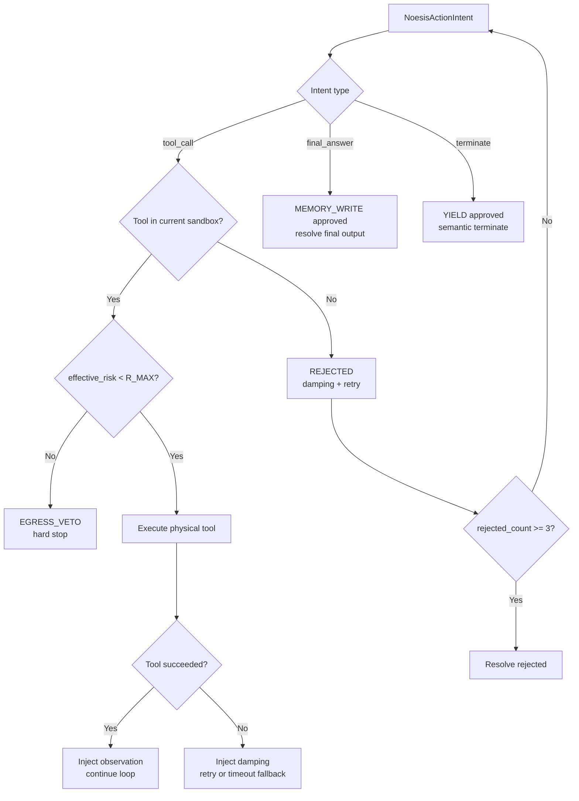

# ACOS Code Logic

> **中文摘要**：ACOS 是一个受控 AI Agent 运行时。LLM 只能提议动作（`NoesisActionIntent`），不能直接调用工具；每步提议经 ACC 预检与动态 sandbox 裁剪后，由 Aegis egress 仲裁；仅 `APPROVED` 的动作才会物理执行；Vitals（ACC + Hypothalamus）通过主循环内联逻辑与 Pulse 旁路持续监控 drift 与代谢压力，必要时熔断。

**In one sentence:** ACOS is a controlled agent runtime where the LLM proposes actions, Aegis must approve them before any physical execution, and Vitals continuously monitor the system for instability or resource exhaustion.

This document describes the **reference implementation** in this repository. It was verified against the current codebase and is intended for contributors, reviewers, and GitHub readers.

---

## Runtime Overview



---

## Step-by-Step Flow

### 1. User Input Enters the System

The user sends an instruction through the Streamlit frontend:

- [`frontend/app_os_terminal.py`](../frontend/app_os_terminal.py)

The frontend loads API keys and runtime settings, then calls the main runtime loop:

- [`agent_os_runtime.py`](../agent_os_runtime.py) — `run_agent_os_once()` (entry at ~line 250)

Feature flags passed from the UI:

| Flag | Effect |
|------|--------|
| `enable_egress` | When `False`, egress is bypassed (testing only) |
| `enable_hypothalamus` | Attaches Hypothalamus pulse listener |
| `enable_acc` | Enables ACC inline scan and pulse listener |
| `return_diagnostics=True` | Returns telemetry dict instead of plain string |

### 2. Aegis Ingress Gate Prepares the Session

Before the LLM sees the task, Aegis handles ingress via [`core_aegis/gateway_runtime.py`](../core_aegis/gateway_runtime.py), which composes:

- [`core_aegis/ingress_gate.py`](../core_aegis/ingress_gate.py) — budget and session bootstrap
- [`core_aegis/amygdala_policy.py`](../core_aegis/amygdala_policy.py) — risk probe (`global_amygdala`)

Ingress responsibilities:

1. **Minimal input normalization** — `strip()` on raw input (not deep regex sanitization)
2. **Session ID** — `sess_<12-char-uuid>`
3. **Compute budget** — default `max_tokens=2000`, `max_steps=10`, plus `tci_score`
4. **Initial tool whitelist** — default `["query_db", "refund_lookup"]`, or `[]` when `hijack_flag=True`

Amygdala risk probe (`global_amygdala`) detects patterns such as:

- Jailbreak / bypass / privilege escalation keywords
- Sensitive data requests (passwords, credentials, internal data)
- High-threat combinations that raise `tci_score` and may set `hijack_flag` when `tci >= 0.8`

When `hijack_flag` is set at ingress, `allowed_tools` is empty and egress will later emit `HARD_MELTDOWN` on hijack detection.

### 3. Noesis Thinks, But Cannot Execute

Noesis is the cognitive layer:

- [`core_noesis/noesis_kernel.py`](../core_noesis/noesis_kernel.py) — `NoesisRuntimeKernel`

Each step in `run_step()`:

1. **Basal Ganglia** ([`basal_ganglia_gating.py`](../core_noesis/cognitive_modules/basal_ganglia/basal_ganglia_gating.py)) — fast reflex router that may resolve the tensor without calling the LLM (dictionary hits, short input blocks, repeated-character entropy attacks, hardcoded SOPs)
2. **PFC LLM step** — [`PFCExecutor`](../core_noesis/cognitive_modules/pfc/pfc_executor.py) via [`NoesisLLMClient`](../core_noesis/llm_client.py) alias; outputs a JSON object into `pfc_trace`
3. **Intent derivation** — [`derive_action_intent()`](../core_noesis/adapters/intent_adapter.py) parses the trace (plus deterministic business/test adapters) into a typed intent

The LLM does **not** directly emit `NoesisActionIntent`. It writes structured JSON to the trace; the adapter converts it.

Intent type — [`NoesisActionIntent`](../protocol_schema.py) (`ControlAction`):

| `action_type` | Meaning |
|---------------|---------|
| `tool_call` | Propose a tool with `tool_name` + `parameters` |
| `final_answer` | Propose a terminal answer string |
| `terminate` | Propose semantic termination (no physical tool) |

Noesis can only say *"I want to call this tool with these parameters."* It cannot execute the tool.

### 4. Runtime Converts Intent Into an Action Request

The runtime maps intent to protocol action types in `_map_intent_to_action()` and builds `NoesisActionRequest` in `_build_noesis_request()` (~lines 93–124, called at ~line 402):

| Intent | `NoesisActionRequest.proposed_action` |
|--------|---------------------------------------|
| `tool_call` | `ActionType.TOOL_CALL` |
| `final_answer` | `ActionType.MEMORY_WRITE` |
| `terminate` | `ActionType.YIELD` |

### 5. Dynamic Sandbox (Before Egress)

On every loop iteration, **before** Noesis runs, the runtime:

1. Reads phase capabilities from [`RuntimeStateBus`](../core_runtime/runtime_stack.py)
2. Calls `prepare_sandbox_environment()` to semantically prune the tool list based on drift, objective embedding, and phase locks
3. Updates `ingress.allowed_tools` with the pruned set

This is **not** a static whitelist from ingress alone — the allowed tool set changes each step.

### 6. ACC Pre-Egress Scan (Inline + Pulse)

[`UnifiedACCMonitor`](../core_vitals/acc_monitor.py) operates on **two paths**:

| Path | When | Effect |
|------|------|--------|
| **Inline** (main loop) | Before egress each step | Scores entropy/conflict; soft drift → damping + sandbox tighten + `continue`; hard drift → `PFC_MELTDOWN` |
| **Pulse listener** | On `PulseSnapshot` broadcast | Async damping injection and metadata conflict flags |

ACC checks logical entropy and conflict risk (e.g., dangerous payload keywords, tool not in `allowed_tools`, bypass language in reasoning trajectory).

### 7. Aegis Egress Gate Decides If the Action Is Allowed

Before any physical tool runs, the action goes through [`core_aegis/egress_gate.py`](../core_aegis/egress_gate.py).

Hard guards (in order):

1. `step_count > max_steps` → `HARD_MELTDOWN`
2. `hijack_flag` from ingress policy state → `HARD_MELTDOWN`
3. For `TOOL_CALL`: payload schema validation → `REJECTED` on failure
4. For `TOOL_CALL`: tool must be in `ingress.allowed_tools` → `REJECTED`
5. **Risk equation** — [`AegisEgressGateway`](../core_aegis/aegis_egress.py) computes `effective_risk`; if `>= R_MAX` → `REJECTED` with `"egress equation veto"` (runtime treats this as a hard stop)

Returns `AegisDecision` with status:

| Status | Implemented | Notes |
|--------|-------------|-------|
| `APPROVED` | Yes | Physical execution may proceed |
| `REJECTED` | Yes | Damping injected; retry up to 3 times |
| `HARD_MELTDOWN` | Yes | Immediate resolve and halt |
| `OVERRIDE` | Schema only | Not implemented in egress; see RFC draft |

### 8. Tools Only Run After Approval

If Aegis approves, the runtime executes via `_execute_physical_action()` (~line 199):

- Tool lookup: [`PhysicalToolRegistry`](../core_runtime/runtime_stack.py)
- Handler dispatch with fault isolation
- On `TOOL_CALL` success: `inject_observation()` (or `inject_memory()` fallback)
- On tool failure: damping injection; timeout-like errors trigger `AGENT_OS_TIMEOUT_FALLBACK`

Loop pattern:

```text
think → propose intent → ACC pre-scan → egress approve → execute → observe → think again
```

### 9. Vitals Monitor the System (Pulse Side-Channel)

[`HypothalamusPulseListener`](../core_vitals/metabolism_circuit_breaker.py) watches token usage and metabolic pressure from pulse snapshots. It can call `tensor.resolve()` directly on:

- `HARD_MELTDOWN` — instability index breach
- `BUDGET_EXHAUSTED` — effective token cost exceeds base budget

This is a **side-channel termination** — the main loop may still be running when Hypothalamus resolves the tensor.

### 10. PulseSnapshot Is the Runtime Heartbeat

At each step, the runtime broadcasts a [`PulseSnapshot`](../protocol_schema.py) (~`_emit_runtime_pulse`, line 318):

| Field | Description |
|-------|-------------|
| `step` | Current loop step |
| `current_tokens` | Accumulated token usage |
| `logical_entropy` | Current logical entropy estimate |
| `retries` | `rejected_count` (egress rejections + tool failures) |
| `tci_score` | Threat score from ingress budget |
| `last_step_data` | Proposed action, payload, reasoning, `allowed_tools`, terminal flags |

Note: `effective_risk`, `trust_level`, and `icu_mode` live in session policy state and `action_payload`, not in `PulseSnapshot` itself.

### 11. The Loop Ends

The loop ends when `tensor.is_resolved` becomes true. Causes include:

| Termination cause | Trigger |
|-------------------|---------|
| `AGENT_OS_APPROVED_FINAL_ANSWER` | Approved `MEMORY_WRITE` with `final_answer` in payload |
| `AGENT_OS_NOESIS_TERMINATE` | Approved `YIELD` after `terminate` intent |
| `AGENT_OS_YIELD_FINALIZE` | Approved `YIELD` with `final_answer` in latest thought |
| `AGENT_OS_TIMEOUT: MAX_STEP_REACHED` | `step > max_steps` before Noesis step |
| `AGENT_OS_PFC_MELTDOWN: UNRECOVERABLE_DRIFT` | Drift above `hard_drift_threshold` |
| `AGENT_OS_HARD_MELTDOWN: SAFETY_BUDGET_OVERFLOW` | Egress `HARD_MELTDOWN` (step overflow, hijack) |
| `AGENT_OS_EGRESS: R_EFFECTIVE_EXCEEDED` | Egress equation veto |
| `AGENT_OS_POLICY_REJECT: RETRY_LIMIT_EXCEEDED` | `rejected_count >= 3` |
| `AGENT_OS_TIMEOUT_FALLBACK: TOOL_TIMEOUT` | Tool error message contains `timeout` |
| `AGENT_OS_METABOLIC_MELTDOWN` | Hypothalamus pulse listener |
| Basal Ganglia reflex | `tensor.resolve()` on first-step intercept |

The frontend displays the final result and writes rows to `st.session_state.audit_logs` (System Telemetry tab). Optional cloud logging via [`backend/supabase_logger.py`](../backend/supabase_logger.py) when Supabase is configured.

---

## Core Loop Sequence



---

## Module Map



---

## Decision Outcomes



---

## Common Misconceptions

| Misconception | Actual behavior |
|---------------|-----------------|
| Ingress deeply sanitizes input | Ingress only `strip()`s; risk scoring is in amygdala, not regex cleaning |
| LLM directly outputs `NoesisActionIntent` | PFC writes JSON to `pfc_trace`; `derive_action_intent()` parses it |
| `allowed_tools` is fixed at ingress | `prepare_sandbox_environment()` re-prunes tools every step |
| ACC only listens to pulses | ACC also runs inline in the main loop before egress |
| Egress uses a simple risk threshold | Uses `AegisEgressGateway` non-linear equation with momentum |
| `final_answer` has a separate approval path | Maps to `MEMORY_WRITE`; egress approves like any other action |
| `OVERRIDE` is usable | Defined in schema only; not emitted by current egress implementation |
| Only the main loop can end the session | Hypothalamus and Basal Ganglia can resolve the tensor from side paths |

---

## Related Documents

- [ACOS Whitepaper](./WHITEPAPER.md) — industry-facing architecture and governance model
- [Implementation Status](./implementation_status.md) — known gaps and engineering priorities
- [Aegis CCB Zero-Trust Execution Contract (RFC draft)](./aegis_ccb_zero_trust_execution_contract_rfc_draft.md)
- [AC-OS Core Architecture Manifest v1.2](./ac_os_core_architecture_manifest_v1_2.yaml)
- [Runtime change log (2026-04-30)](./runtime-change-log-2026-04-30.md)

---

## How To Run Checks

```bash
python3 auto_test/run_all.py
python3 -m unittest -v auto_test.test_agent_os_runtime_telemetry_split
python3 scripts/check_aegis_core_sovereignty.py
PYTHONPYCACHEPREFIX=/tmp/acos_pycache python3 -m compileall -q .
```
